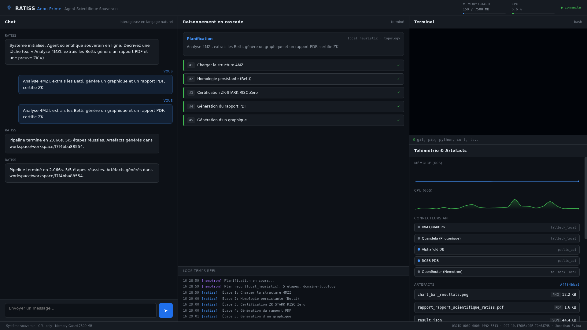
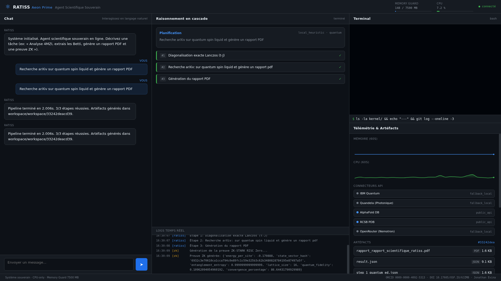
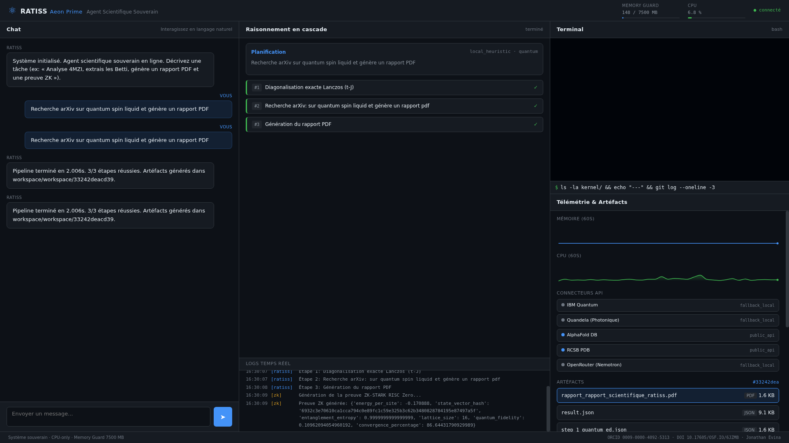
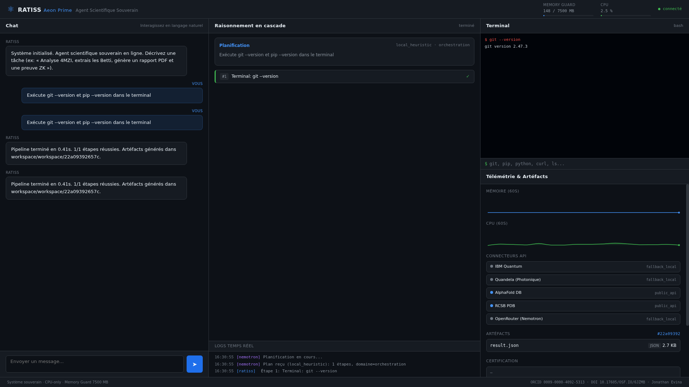

# RATISS Aeon Agent

**Agent scientifique autonome souverain** — type Manus IA / OpenManus, combinant physique quantique (Lanczos ED), topologie computationnelle, biologie structurale, cryptographie (ZK-STARK), **browser web (Playwright)**, **terminal intégré**, **exécution Python sandbox**, **recherche web générale**, **éditeur de fichiers** et **génération de contenu** (PDF, graphiques, pages web).

> Auteur : **Jonathan Evina** · ORCID [0009-0000-4092-5313](https://orcid.org/0009-0000-4092-5313) · DOI [10.17605/OSF.IO/6JZMB](https://doi.org/10.17605/OSF.IO/6JZMB)

---

## Captures d'écran

| Dashboard complet | Recherche arXiv + PDF |
|:---:|:---:|
|  |  |

| Preview PDF intégré | Terminal en action |
|:---:|:---:|
|  |  |

## Vue d'ensemble

RATISS (Real-time Adaptive Topological & Integrative Scientific System) Aeon Prime est un agent scientifique autonome qui :

1. **Planifie** une tâche en langage naturel (Nemotron 3 Ultra via OpenRouter, ou planificateur local déterministe en fallback)
2. **Exécute** chaque étape via la **boucle ReAct** (Think → Act → Observe) avec détection de blocage
3. **Certifie** les résultats avec une preuve ZK-STARK RISC Zero (vérifiée en < 1 ms)
4. **Génère** des artéfacts téléchargeables (JSON, reçus ZK, diagrammes, PDF, screenshots)

Le tout dans un Memory Guard strict (7500 Mo, CPU-only), 100 % souverain : aucune donnée ne quitte la machine sans clé API explicite.

## Nouveautés — Manus IA tools (v9.1)

RATISS intègre désormais les mêmes capacités qu'OpenManus/Manus IA :

| Outil | Équivalent OpenManus | Description |
|-------|---------------------|-------------|
| **Browser** (Playwright) | `BrowserUseTool` | Naviguer, cliquer, taper, extraire, screenshot, scroller |
| **PythonExecute** | `PythonExecute` | Exécuter du code Python dans un sandbox (numpy, scipy, matplotlib) |
| **GoogleSearch** | `GoogleSearch` | Recherche web générale (Tavily API + DuckDuckGo fallback) |
| **FileEditor** | `StrReplaceEditor` | Voir, créer, éditer des fichiers (str_replace, insert, undo) |
| **FileSaver** | `FileSaver` | Sauvegarder du contenu arbitraire dans le workspace |
| **ReAct loop** | `ReActAgent` | Boucle Think → Act → Observe avec détection de blocage |

## Architecture

    ratiss-kkl/
    ├── app/                    # Serveur FastAPI + UI
    │   ├── server.py           #   HTTP + WebSocket multiplexé
    │   └── static/             #   HTML/CSS/JS + D3.js local (280 Ko)
    ├── kernel/                 # Noyau scientifique RATISS V9
    │   ├── main.py             #   Pipeline orchestré (Topo → Quantique → ZK)
    │   ├── bridge.py           #   Pont typé vers l'orchestrateur
    │   ├── solvers/            #   Lanczos ED, homologie persistante, tryperposition
    │   ├── connectors/         #   IBM Quantum, Quandela, AlphaFold, RCSB
    │   ├── core/               #   Refinery, modules de base
    │   ├── system/             #   Memory Guard (7500 Mo)
    │   └── zk/                 #   Prover ZK-STARK RISC Zero
    ├── orchestrator/           # Agent agentique
    │   ├── agent.py            #   Boucle Plan → Execute → Certify → Artifact + refine()
    │   ├── nemotron_client.py  #   Client OpenRouter (Nemotron 3 Ultra)
    │   ├── skill_manager.py    #   Registre des compétences noyau
    │   ├── cascade.py          #   Émetteur d'événements WebSocket
    │   ├── auto_improve.py     #   Couche RLM : analyse trajectoire + leçons + validation ZK
    │   └── harness_manager.py  #   Continual Harness : état persistant + CRUD + versioning
    ├── security/               # Sécurité souveraine
    │   ├── session_manager.py  #   Sessions SQLite + auth PBKDF2
    │   ├── token_hasher.py     #   PBKDF2-HMAC-SHA256 (600K itérations)
    │   ├── workspace_isolator.py #  Isolation physique par session
    │   └── sandbox_hardener.py #   NemoSandbox (Docker ou Python restreint)
    ├── scripts/                # Outils
    │   ├── init_vault.py       #   Initialise le coffre + admin
    │   ├── import_skill.py     #   Importe/teste une compétence GitHub
    │   ├── align_agent.py      #   Alignement + vérification
    │   └── deploy.sh           #   Déploiement (local/docker/hf/vercel)
    ├── tests/                  # Tests (auto-amélioration, pipeline)
    ├── harness/                # État du Continual Harness (généré à l'exécution)
    ├── data/pdb/               # Structures PDB locales (4MZI, 4MZR)
    ├── config/                 # allowed_imports.txt, agent_aligned.json
    ├── Dockerfile              # HF Spaces / VPS (port 7860)
    ├── requirements.txt        # Dépendances minimales (frugal)
    └── .env.example            # Variables d'environnement (sans secrets)

## Nouveautés — Couche d'auto-amélioration (RLM / Continual Harness) (v9.2)

RATISS intègre désormais une **boucle d'auto-amélioration par validation**, inspirée
des architectures **Recursive Language Model (RLM)** et **Continual Harness** de
Prime Agent. À partir d'une tâche complexe **validée** (certification ZK-STARK), l'agent
analyse sa propre trajectoire, en extrait des « leçons » et les réinjecte dans son
harnais (prompts, compétences, mémoire, sous-agents) pour améliorer ses performances
futures.

### Architecture

```
[Exécution d'une tâche complexe]
        │
        ▼
[Validation du résultat (ZK-STARK, invariants physiques)]
        │
        ▼ (si validé)
[Analyse de la trajectoire : planification, étapes, raisonnements, artéfacts]
        │
        ▼
[Extraction des « leçons » : patterns, heuristiques, méthodes efficaces, erreurs évitées]
        │
        ▼
[Validation ZK des leçons (invariants physiques préservés)]
        │
        ▼
[Mise à jour du « Harness » : prompts, compétences, mémoire, sous-agents (CRUD + versioning)]
        │
        ▼
[Amélioration des performances futures]
```

### Modules

| Module | Rôle |
|--------|------|
| `orchestrator/auto_improve.py` | Analyse la trajectoire (plan, étapes, logs, résultats), extrait les patterns récurrents et génère des leçons structurées (JSON). Validation ZK des leçons. |
| `orchestrator/harness_manager.py` | État persistant et versionné du harnais (prompts, compétences, mémoire, sous-agents). CRUD ciblé + snapshots horodatés + rollback. |
| Commande `/refine` | Déclenche l'analyse de la trajectoire courante, propose des améliorations, et (après validation utilisateur) applique les mises à jour + génère un rapport PDF. |

### Types de leçons extraites

| Type | Cible | Description |
|------|-------|-------------|
| `pattern` | prompt | Séquence d'actions validée (à réutiliser pour ce domaine) |
| `heuristic` | skill | Règle générale dérivée (budget temps, paramètres par défaut) |
| `pitfall` | prompt/subagent | Erreur/piège rencontré (à éviter) |
| `memory` | memory | Fait observable stable (Betti 4MZI, E₀ t-J, PDB disponible) |

### Intégration avec les compétences existantes

- **`zk_proof`** : certifie que les leçons proposées ne violent pas les invariants physiques (énergie < 0, entropie ≥ 0, dimensions réseau valides). Aucune mise à jour n'est appliquée si la preuve ZK est invalide.
- **`generate_pdf`** : produit un rapport d'auto-amélioration (versioning des leçons appliquées, trajectoire analysée, validation ZK).
- **`file_editor`** : les fichiers de configuration du harnais (`harness/harness_state.json`, snapshots) sont gérés via le `HarnessManager`.

### Commande `/refine`

Dans le chat, après avoir exécuté une tâche complexe :

```
/refine          → analyse la trajectoire, affiche les leçons proposées (bannière Accepter/Rejeter)
/refine apply    → analyse ET applique les mises à jour au harnais + génère le rapport PDF
/harness         → affiche l'état courant du harnais (version, mémoire, prompts, trajectoires)
```

L'UI affiche une **bannière de proposition** avec chaque leçon (type, cible, confiance,
contenu) et des boutons **✓ Appliquer au harnais** / **✕ Rejeter**. L'application
incrémente la version du harnais et crée un snapshot horodaté (rollback possible).

### Persistance (`harness/`)

```
harness/
├── harness_state.json     # état courant (versionné)
├── lessons/               # archive des leçons appliquées (JSON, une par fichier)
├── trajectories/          # trajectoires de tâches analysables par /refine
└── versions/              # snapshots horodatés (v0000_*.json, v0001_*.json, ...)
```

Souveraineté : l'analyse est **déterministe** (heuristiques locales, aucun appel LLM
externe requis). Si Nemotron/OpenRouter est disponible, un enrichissement optionnel
peut être branché, mais le chemin par défaut reste local.

## Démarrage rapide

```bash
pip install -r requirements.txt
cp .env.example .env   # optionnel : configurer les clés API
python -m app.server   # UI : http://localhost:7860
```

## Interface web (4 panneaux)

- **Chat** : Décrivez une tâche en langage naturel
- **Raisonnement en cascade** : Plan + étapes en temps réel + logs
- **Terminal** : Exécutez des commandes shell (git, pip, curl...) avec sortie streaming temps réel
- **Télémétrie & Artéfacts** : Memory Guard, CPU, connecteurs, artéfacts previewable, certification ZK

Exemples de tâches :
- `Analyse 4MZI, extrais les Betti, génère un graphique et un rapport PDF, certifie ZK`
- `Calcule l'état fondamental t-J sur grille 4×4`
- `Recherche arXiv sur quantum spin liquid et génère un rapport PDF`
- `Recherche PubMed sur p53 MDM2`
- `Recherche ChEMBL pour l'aspirine`
- `Exécute git --version dans le terminal`
- `Navigue vers https://arxiv.org et prends un screenshot`
- `Calcule la matrice en python (det + eigenvalues)`
- `Recherche web sur Lanczos algorithm quantum`
- `Crée le fichier analyse.py avec un script numpy`
- `Pipeline complet quantique + topologie + certification`
- `Tryperposition unifiée Q ⊗ I ⊗ M`

## API REST

| Endpoint | Méthode | Description |
|----------|---------|-------------|
| `/api/health` | GET | Santé du système |
| `/api/memory` | GET | État du Memory Guard |
| `/api/connectors` | GET | Statut des connecteurs API |
| `/api/pdb` | GET | Structures PDB locales |
| `/api/skills` | GET | 23 compétences disponibles |
| `/api/run?task=...` | POST | Exécution synchrone (ReAct) |
| `/api/terminal?command=...` | POST | Exécution directe terminal |
| `/api/browser` | POST | Browser automation (navigate, click, screenshot...) |
| `/api/python` | POST | Exécution Python sandbox |
| `/api/search` | POST | Recherche web (Tavily/DuckDuckGo) |
| `/api/file` | POST | Éditeur de fichiers (view, create, str_replace) |
| `/api/refine` | POST | Auto-amélioration : analyse une trajectoire, renvoie leçons + propositions (body: `{"apply": true}` pour appliquer) |
| `/api/harness` | GET | État du harnais d'auto-amélioration (version, mémoire, prompts, trajectoires) |
| `/api/harness/rollback` | POST | Restaure une version antérieure du harnais (body: `{"version": N}`) |
| `/api/preview/{filename}` | GET | Sert un artéfact (PDF, PNG, HTML) |
| `/api/artifacts/{session}` | GET | Liste des artéfacts |
| `/ws` | WebSocket | Canal multiplexé temps réel (chat + terminal + browser + python) |

## Compétences (23 actions)

### Scientifiques (6)
| Action | Description | Catégorie |
|--------|-------------|-----------|
| `load_pdb` | Chargement structure PDB | Biologie |
| `topology` | Homologie persistante (GUDHI / fallback natif) | Topologie |
| `quantum_ed` | Diagonalisation exacte Lanczos (modèle t-J) | Physique |
| `zk_proof` | Preuve ZK-STARK RISC Zero | Cryptographie |
| `full_pipeline` | Pipeline complet RATISS | Orchestration |
| `tryperposition` | Tryperposition unifiée Q ⊗ I ⊗ M | Orchestration |

### Terminal (2) — type Manus IA
| Action | Description | Catégorie |
|--------|-------------|-----------|
| `terminal` | Exécute une commande shell (streaming WebSocket temps réel) | Terminal |
| `git_clone` | Clone un dépôt Git dans le workspace | Terminal |

Commandes autorisées : git, pip, python, curl, wget, ls, cat, grep, find, tar, npm, node, dot, etc.
Sécurité : allowlist stricte, détection de patterns dangereux (rm -rf /, sudo, curl|bash), timeout 30s.

### Web scientifique (6)
| Action | Description | Catégorie |
|--------|-------------|-----------|
| `web_fetch` | Récupère le contenu d'une URL (HTML, JSON, texte) | Web |
| `web_arxiv` | Recherche sur arXiv (prépublications) | Web |
| `web_pubmed` | Recherche sur PubMed (E-utilities NCBI) | Web |
| `web_chembl` | Recherche de composés sur ChEMBL | Web |
| `web_pdb` | Récupère une structure PDB (RCSB API) | Web |
| `web_alphafold` | Récupère une prédiction AlphaFold DB | Web |

### Génération de contenu (4)
| Action | Description | Catégorie |
|--------|-------------|-----------|
| `generate_pdf` | Rapport scientifique PDF (fpdf2, en-tête RATISS, sections) | Contenu |
| `generate_chart` | Graphique PNG (bar, line, scatter, pie — matplotlib) | Contenu |
| `generate_webpage` | Page HTML previewable (style intégré) | Contenu |
| `generate_betti_diagram` | Diagramme de persistance (topologie) | Contenu |

### Manus IA tools (5) — nouveaux en v9.1
| Action | Description | Catégorie |
|--------|-------------|-----------|
| `browser` | Navigation web Playwright (navigate, click, type, extract, screenshot, scroll, state, back) | Browser |
| `python_execute` | Exécution Python sandbox (numpy, scipy, matplotlib, timeout 30s) | Code |
| `google_search` | Recherche web générale (Tavily API + DuckDuckGo fallback) | Web |
| `file_editor` | Éditeur de fichiers (view, create, str_replace, insert, undo, list) | Files |
| `file_saver` | Sauvegarder du contenu arbitraire dans le workspace | Files |

Tous les artéfacts sont previewables directement dans l'UI (iframe pour HTML, embed pour PDF, img pour PNG/SVG).

## Connecteurs API

| Connecteur | Mode | Fallback |
|------------|------|----------|
| IBM Quantum | Live (si token) | Lanczos ED local |
| Quandela | Live (si token) | Simulateur photonique local |
| AlphaFold DB | API publique | — |
| RCSB PDB | API publique | — |
| OpenRouter (Nemotron) | Live (si clé) | Planificateur local déterministe |

## Sécurité

- **Memory Guard** : limite stricte 7500 Mo, surveillance temps réel
- **Sessions** : SQLite local, jetons PBKDF2-HMAC-SHA256 (600 000 itérations)
- **Isolation** : workspace physique par session
- **Sandbox** : NemoSandbox — Docker éphémère (réseau désactivé, mem 2g, read-only) ou Python restreint (liste blanche d'imports)
- **Souveraineté** : aucune donnée envoyée vers un service cloud sans clé API explicite

## Déploiement

```bash
./scripts/deploy.sh local    # serveur local
./scripts/deploy.sh docker   # conteneur Docker
./scripts/deploy.sh hf       # Hugging Face Spaces
./scripts/deploy.sh vercel   # UI statique Vercel
```

## Dépendances

Python 3.11+, dépendances minimales (frugal) : `fastapi`, `uvicorn`, `websockets`, `numpy`, `scipy`, `psutil`.

Optionnels (fallbacks natifs si absents) : `qiskit`, `qiskit-ibm-runtime`, `gudhi`, `perceval`, `biopython`.

## Licence

MIT — Jonathan Evina, 2025-2026
